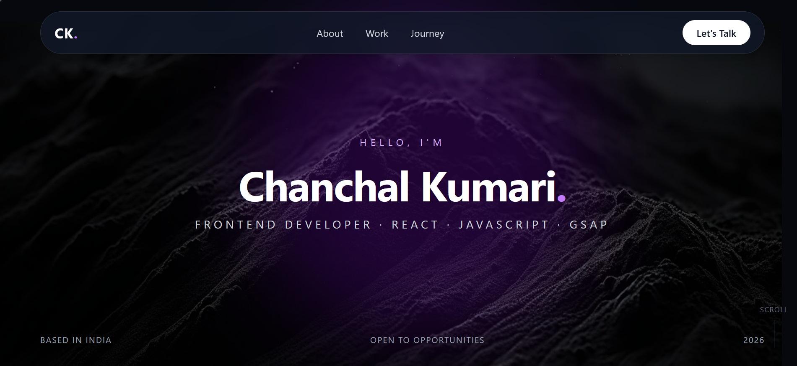
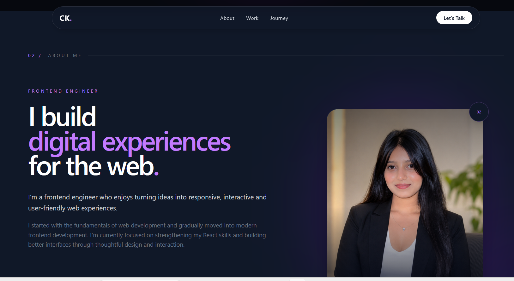
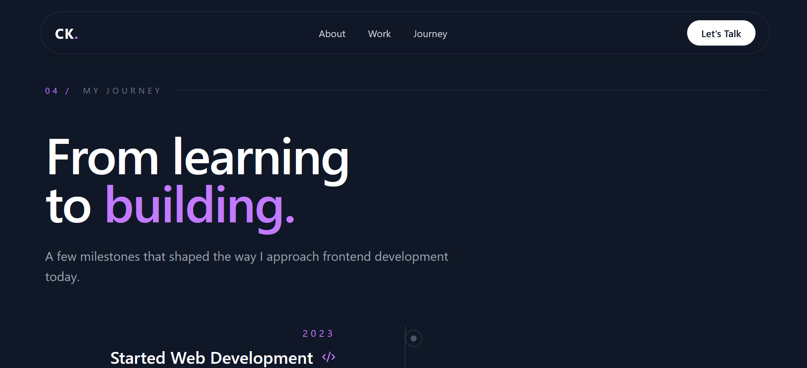
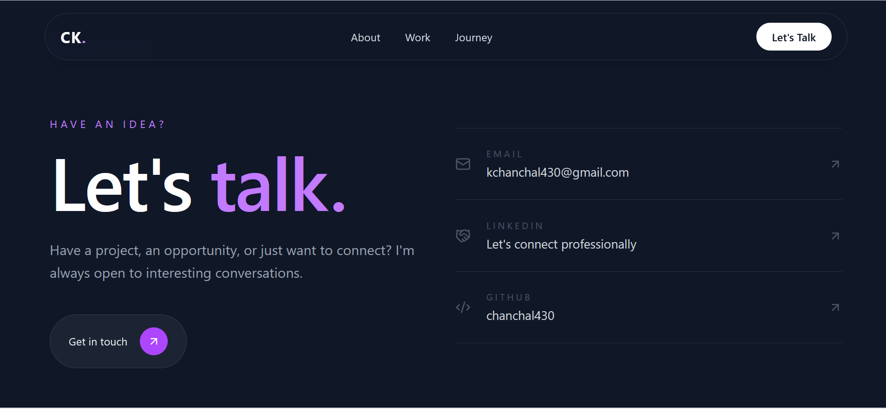

# Personal Portfolio

A responsive frontend developer portfolio built with **React, Tailwind CSS, and GSAP**.  
It showcases my projects, development journey, and contact information with smooth animations and interactive UI.

## ✨ Features

- Responsive design for desktop, tablet, and mobile
- GSAP entrance animations
- ScrollTrigger animations
- Mouse parallax effect
- Interactive project cards
- Responsive journey timeline
- Contact section with social links

## 🛠️ Tech Stack

- React
- JavaScript
- Tailwind CSS
- GSAP
- GSAP ScrollTrigger
- Lucide React
- Vite

## 📸 Screenshots

### Hero



### About



### Journey



### Contact



## 🚀 Getting Started

```bash
git clone https://github.com/chanchal430/Portfolio.git
cd Portfolio
npm install
npm run dev